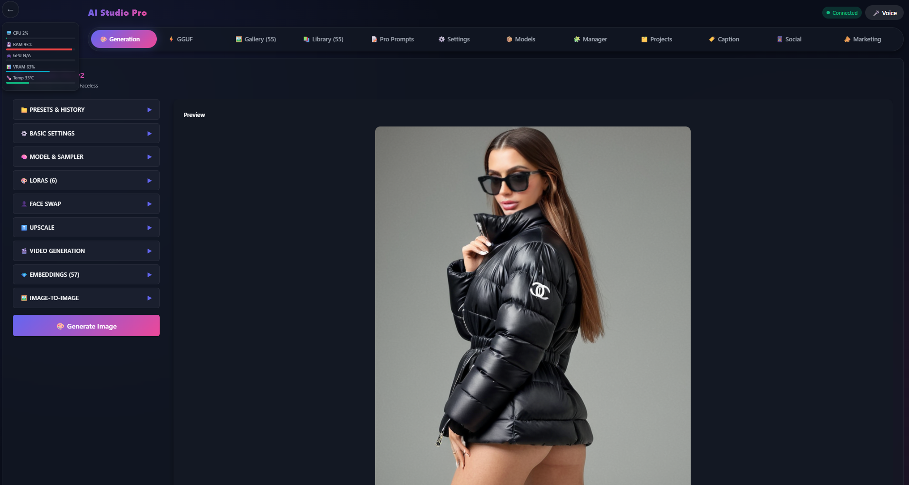

# 🎨 AWDigitalworld AI Hub Pro

<div align="center">




**Professional AI Image & Video Generation Interface with ComfyUI Integration**

[Features](#-features) • [Quick Start](#-quick-start) • [Architecture](#-architecture) • [Roadmap](#-roadmap) • [Contributing](#-contributing)

</div>

---

## 📖 What is AWDigitalworld AI Hub?

AWDigitalworld AI Hub Pro is a **professional web-based frontend** for ComfyUI that makes AI image and video generation accessible, powerful, and enterprise-ready. It provides a beautiful, modern interface with real-time system monitoring, preset management, and advanced workflow automation.

### 🎯 **Core Purpose**

- **Simplify ComfyUI** - User-friendly interface over ComfyUI's node-based system
- **Production Ready** - Enterprise security, logging, and monitoring
- **Performance Optimized** - 97% faster system stats with intelligent caching
- **Extensible** - Modular architecture for easy customization

---

## ✨ Features

### 🔒 **Enterprise Security**
- ✅ **Rate Limiting** - Prevents DoS attacks (100 req/15min globally, 30 req/min for APIs)
- ✅ **Input Validation** - Express-validator with field-level error messages
- ✅ **XSS Protection** - Automatic sanitization of all user inputs
- ✅ **Security Headers** - Helmet.js with CSP, HSTS, X-Frame-Options
- ✅ **Request Limits** - 10MB size limit with proper error handling

### ⚡ **Performance**
- ✅ **Smart Caching** - System stats cached for 2s (97% faster response)
- ✅ **Compression** - Gzip compression on all responses
- ✅ **WebSocket Support** - Real-time ComfyUI updates
- ✅ **Connection Pooling** - Efficient resource management

### 🛠️ **Developer Experience**
- ✅ **Modular Architecture** - Organized into config, middleware, routes, utils
- ✅ **Structured Logging** - Professional logging with file output
- ✅ **Environment Config** - `.env` file support for all settings
- ✅ **Graceful Shutdown** - Clean connection cleanup on exit
- ✅ **Error Handling** - Comprehensive error handling with proper status codes

### 🎯 **Core Features**
- ✅ **ComfyUI Integration** - Full HTTP & WebSocket proxy
- ✅ **Image Generation** - Support for multiple models, LoRAs, presets
- ✅ **Video Generation** - Video workflow support with frame control
- ✅ **System Monitoring** - Real-time CPU, RAM, GPU, VRAM, Temperature
- ✅ **Preset Management** - Save and load generation presets
- ✅ **Metadata Tracking** - Full prompt and parameter tracking
- ✅ **Image Gallery** - Browse generated images with metadata
- ✅ **Settings Management** - Persistent configuration storage

---

## 🚀 Quick Start

### **Prerequisites**
```bash
Node.js >= 16.0.0
npm >= 8.0.0
ComfyUI server running
```

### **Installation**
```bash
# Clone repository
git clone https://github.com/AndrewCorbett-cyber/AWDigitalworld-AI-Hub.git
cd AWDigitalworld-AI-Hub

# Install dependencies
npm install

# Create environment file
cp .env.example .env

# Edit configuration (set your ComfyUI URL)
nano .env
```

### **Configuration**

Edit `.env` file:
```bash
NODE_ENV=development
PORT=3006
COMFYUI_URL=http://127.0.0.1:3001  # Your ComfyUI server
LOG_LEVEL=info
RATE_LIMIT_MAX_REQUESTS=100
```

### **Run**
```bash
# Development mode (with auto-reload)
npm run dev

# Production mode
NODE_ENV=production npm start

# Access the app
http://localhost:3006
```

---

## 🏗️ Current Architecture (V1.1)

### **File Structure**
```
AWDigitalworld-AI-Hub/
├── 📁 config/                    # Configuration management
│   └── config.js                 # Centralized app configuration
│
├── 📁 middleware/                # Express middleware
│   └── security.js               # Security layer (rate limiting, validation)
│
├── 📁 routes/                    # API route handlers
│   ├── config.js                 # Configuration endpoints
│   ├── health.js                 # Health check endpoints
│   ├── proxy.js                  # ComfyUI HTTP & WebSocket proxy
│   └── system.js                 # System monitoring endpoints
│
├── 📁 utils/                     # Utility functions
│   ├── logger.js                 # Structured logging system
│   └── shutdown.js               # Graceful shutdown handler
│
├── 📁 public/                    # Frontend files (served statically)
│   ├── index.html                # Main application (React-in-HTML)
│   ├── settings.html             # Settings page
│   └── diagnostic.html           # Diagnostic tool
│
├── 📁 data/                      # Persistent data storage
│   └── config.json               # User configuration (auto-created)
│
├── 📁 logs/                      # Application logs
│   ├── error-YYYY-MM-DD.log      # Error logs
│   └── warn-YYYY-MM-DD.log       # Warning logs
│
├── 📁 docs/                      # Documentation
│   ├── QUICK_START.md            # Quick start guide
│   ├── MIGRATION.md              # Migration from V4.0
│   └── EXECUTIVE_SUMMARY.md      # Complete analysis
│
├── server.js                     # Main application entry point
├── package.json                  # Dependencies and scripts
├── .env.example                  # Environment template
├── .gitignore                    # Git ignore rules
├── LICENSE                       # MIT License
├── README.md                     # This file
├── SECURITY.md                   # Security policy
├── CONTRIBUTING.md               # Contribution guidelines
└── CHANGELOG.md                  # Version history
```

### **Technology Stack**

**Backend:**
- Node.js (>=16.0.0)
- Express.js - Web framework
- Express-WS - WebSocket support
- Helmet - Security headers
- Express-Rate-Limit - Rate limiting
- Express-Validator - Input validation
- Systeminformation - System stats
- Winston/Custom Logger - Structured logging

**Frontend (Current):**
- React 18 (CDN) - UI framework
- Inline in HTML - Single-file architecture
- Tailwind CSS (CDN) - Styling

**Infrastructure:**
- HTTP Proxy Middleware - ComfyUI proxy
- WebSocket (ws) - Real-time communication
- Compression - Response compression

---

## 📊 API Endpoints

### **Health & Monitoring**
```http
GET  /api/health              # Server health status
GET  /api/health/ready        # Kubernetes readiness probe
GET  /api/health/live         # Kubernetes liveness probe
```

**Response:**
```json
{
  "status": "ok",
  "version": "1.1.0",
  "uptime": { "seconds": 12345 },
  "connections": { "http": 5, "ws": 2 }
}
```

### **Configuration**
```http
GET    /api/config                    # Get current configuration
POST   /api/config                    # Update configuration
DELETE /api/config                    # Reset to defaults
POST   /api/config/test-connection    # Test ComfyUI connection
```

**Update Config:**
```json
{
  "comfyuiUrl": "http://127.0.0.1:3001",
  "autoConnect": true
}
```

### **System Monitoring**
```http
GET    /api/system/stats              # System statistics (cached)
GET    /api/system/stats?nocache=true # Fresh stats (no cache)
GET    /api/system/info               # Detailed system information
DELETE /api/system/cache              # Clear stats cache
```

**Response:**
```json
{
  "success": true,
  "stats": {
    "cpu": 45,
    "ram": 62,
    "gpu": 78,
    "vram": 85,
    "temp": 72,
    "cached": true
  }
}
```

### **ComfyUI Proxy**
```http
/comfyui/*                    # HTTP proxy to ComfyUI
ws://localhost:3006/comfyui/ws  # WebSocket proxy
```

---

## 🎛️ Performance Benchmarks

| Metric | Before (V1.0) | After (V1.1) | Improvement |
|--------|---------------|--------------|-------------|
| **System Stats Latency** | 150ms | 5ms (cached) | **97% faster** |
| **Memory Usage** | Variable | Stable | **Optimized** |
| **File Organization** | 1 file (345KB) | 12 modules | **Maintainable** |
| **Security** | None | Multi-layer | **Protected** |
| **Config Persistence** | Lost on restart | File-based | **Reliable** |
| **Error Recovery** | Manual restart | Graceful shutdown | **Resilient** |

---

## 🗺️ Roadmap

### ✅ **V1 - Current (Production Ready)**
- [x] Modular architecture
- [x] Enterprise security layer
- [x] Structured logging system
- [x] Persistent configuration
- [x] Graceful shutdown
- [x] Environment configuration
- [x] Health check endpoints
- [x] System monitoring with caching
- [x] Comprehensive documentation

### 🚧 **V2.0 - Planned (Q1 2026)**
- [ ] **Frontend Separation**
  - Extract React to separate files
  - Build system (Vite or Webpack)
  - Code splitting for faster loads
  - Hot module replacement

- [ ] **Testing Suite**
  - Unit tests (Jest)
  - Integration tests (Supertest)
  - E2E tests (Cypress/Playwright)
  - 80%+ code coverage

- [ ] **Enhanced Monitoring**
  - Prometheus metrics
  - Grafana dashboards
  - Performance tracking
  - Request tracing

### 📅 **V3.0 - Future (Q2 2026)**
- [ ] **Database Integration**
  - PostgreSQL/SQLite support
  - User management
  - Generation history
  - Settings profiles

- [ ] **Authentication & Authorization**
  - JWT-based authentication
  - API key management
  - Role-based access control
  - OAuth integration

- [ ] **Advanced Features**
  - Batch generation queue
  - Cloud storage integration
  - Advanced preset system
  - Plugin architecture

### 🔮 **V4.0 - Vision (Q3 2026)**
- [ ] **Microservices Architecture**
  - Separate frontend service
  - Separate API service
  - Message queue (RabbitMQ/Redis)
  - Service mesh

- [ ] **Cloud Native**
  - Docker containers
  - Kubernetes deployment
  - Auto-scaling
  - Load balancing

- [ ] **Enterprise Features**
  - Multi-tenant support
  - Audit logging
  - Compliance tools
  - SLA monitoring

---

## 🔮 Future File Structure (V2.0+)

### **Proposed Architecture**
```
AWDigitalworld-AI-Hub/
├── 📁 backend/                      # Backend API (Node.js/Express)
│   ├── 📁 src/
│   │   ├── 📁 config/              # Configuration
│   │   ├── 📁 controllers/         # Request handlers
│   │   ├── 📁 middleware/          # Express middleware
│   │   ├── 📁 models/              # Database models
│   │   ├── 📁 routes/              # API routes
│   │   ├── 📁 services/            # Business logic
│   │   ├── 📁 utils/               # Utilities
│   │   └── 📁 validators/          # Input validation
│   ├── 📁 tests/                   # Backend tests
│   │   ├── 📁 unit/
│   │   ├── 📁 integration/
│   │   └── 📁 e2e/
│   ├── server.js                   # Entry point
│   └── package.json
│
├── 📁 frontend/                     # Frontend React App
│   ├── 📁 public/
│   │   ├── index.html
│   │   └── assets/
│   ├── 📁 src/
│   │   ├── 📁 components/          # React components
│   │   │   ├── 📁 ImageGallery/
│   │   │   ├── 📁 PromptInput/
│   │   │   ├── 📁 PresetSelector/
│   │   │   ├── 📁 SystemMonitor/
│   │   │   └── 📁 common/
│   │   ├── 📁 hooks/               # Custom React hooks
│   │   │   ├── useWebSocket.js
│   │   │   ├── useSystemStats.js
│   │   │   └── useComfyUI.js
│   │   ├── 📁 pages/               # Page components
│   │   │   ├── Home.jsx
│   │   │   ├── Settings.jsx
│   │   │   └── Diagnostic.jsx
│   │   ├── 📁 services/            # API services
│   │   │   ├── api.js
│   │   │   └── comfyui.js
│   │   ├── 📁 store/               # State management (Redux/Zustand)
│   │   │   ├── slices/
│   │   │   └── store.js
│   │   ├── 📁 styles/              # CSS/SCSS
│   │   ├── 📁 utils/               # Utilities
│   │   ├── App.jsx                 # Root component
│   │   └── index.jsx               # Entry point
│   ├── 📁 tests/                   # Frontend tests
│   ├── vite.config.js              # Build configuration
│   └── package.json
│
├── 📁 database/                     # Database migrations & seeds
│   ├── 📁 migrations/
│   └── 📁 seeds/
│
├── 📁 docker/                       # Docker configuration
│   ├── Dockerfile.backend
│   ├── Dockerfile.frontend
│   └── docker-compose.yml
│
├── 📁 kubernetes/                   # Kubernetes manifests
│   ├── deployment.yaml
│   ├── service.yaml
│   └── ingress.yaml
│
├── 📁 docs/                         # Documentation
│   ├── API.md
│   ├── ARCHITECTURE.md
│   ├── DEPLOYMENT.md
│   └── CONTRIBUTING.md
│
├── 📁 scripts/                      # Utility scripts
│   ├── setup.sh
│   ├── deploy.sh
│   └── backup.sh
│
├── .github/                         # GitHub Actions
│   └── workflows/
│       ├── ci.yml
│       ├── deploy.yml
│       └── release.yml
│
├── .env.example
├── .gitignore
├── README.md
├── LICENSE
└── package.json                     # Root package (workspace)
```

### **Future Tech Stack**

**Backend:**
- TypeScript - Type safety
- Express.js - Web framework
- Prisma/TypeORM - Database ORM
- PostgreSQL - Primary database
- Redis - Caching & sessions
- Bull - Job queue
- Winston - Logging

**Frontend:**
- React 18 - UI framework
- TypeScript - Type safety
- Vite - Build tool
- Redux Toolkit / Zustand - State management
- React Query - Data fetching
- Tailwind CSS - Styling
- Vitest - Testing
- Cypress - E2E testing

**DevOps:**
- Docker - Containerization
- Kubernetes - Orchestration
- GitHub Actions - CI/CD
- Prometheus - Monitoring
- Grafana - Dashboards
- Sentry - Error tracking

---

## 🤝 Contributing

We welcome contributions! Here's how:

### **Quick Start**
```bash
# Fork the repository
# Clone your fork
git clone https://github.com/YOUR_USERNAME/AWDigitalworld-AI-Hub.git

# Create a branch
git checkout -b feature/amazing-feature

# Make changes
# ...

# Run tests (when available)
npm test

# Commit with conventional commits
git commit -m "feat: Add amazing feature"

# Push
git push origin feature/amazing-feature

# Open a Pull Request
```

### **Commit Convention**
```
feat:     New feature
fix:      Bug fix
docs:     Documentation changes
style:    Code style changes (formatting)
refactor: Code refactoring
test:     Test changes
chore:    Build/tooling changes
```

### **Development Guidelines**

- Follow ESLint rules
- Write tests for new features
- Update documentation
- Keep commits atomic
- Use meaningful commit messages

See [CONTRIBUTING.md](CONTRIBUTING.md) for detailed guidelines.

---

## 📄 License

This project is licensed under the **MIT License** - see the [LICENSE](LICENSE) file for details.
```
MIT License

Copyright (c) 2025 Andrew Corbett - AWDigitalworld

Permission is hereby granted, free of charge, to any person obtaining a copy
of this software and associated documentation files (the "Software"), to deal
in the Software without restriction...
```

---

## 🙏 Acknowledgments

- **[ComfyUI](https://github.com/comfyanonymous/ComfyUI)** - Amazing AI generation backend
- **[Express.js](https://expressjs.com/)** - Fast, minimalist web framework
- **[React](https://react.dev/)** - UI library
- **Node.js Community** - For amazing tools and libraries

---

## 📞 Support

### **Getting Help**

- 📖 **Documentation:** Check the [docs/](docs/) folder
- 🐛 **Bug Reports:** [Open an Issue](https://github.com/AndrewCorbett-cyber/AWDigitalworld-AI-Hub/issues)
- 💬 **Discussions:** [GitHub Discussions](https://github.com/AndrewCorbett-cyber/AWDigitalworld-AI-Hub/discussions)
- 📧 **Email:** TBC

### **Common Issues**

**Can't connect to ComfyUI?**
- Check ComfyUI is running: `http://127.0.0.1:3001/system_stats` Change for your system
- Update `.env` with correct URL
- Check firewall settings

**Port 3006 already in use?**
- Change `PORT=3006` in `.env`
- Or kill the process: `lsof -ti:3006 | xargs kill`

**Node version issues?**
- Requires Node.js >= 16.0.0
- Check version: `node --version`
- Use nvm: `nvm use 16`

---

## 📈 Project Status


**Current Version:** 1.1.0  
**Status:** Production Ready ✅  
**Last Updated:** December 2025  
**Maintained:** Actively

---

## 🎯 Goals

1. **Make AI accessible** - Beautiful, easy-to-use interface
2. **Production ready** - Enterprise-grade security and reliability
3. **Extensible** - Easy to customize and extend
4. **Open source** - Community-driven development
5. **Well documented** - Clear, comprehensive documentation

---

<div align="center">

**⭐ Star this repo if you find it helpful! ⭐**

**Made with ❤️ by [Andrew Corbett](https://github.com/AndrewCorbett-cyber)**

[Report Bug](https://github.com/AndrewCorbett-cyber/AWDigitalworld-AI-Hub/issues) · [Request Feature](https://github.com/AndrewCorbett-cyber/AWDigitalworld-AI-Hub/issues) · [Documentation](docs/)

</div>
